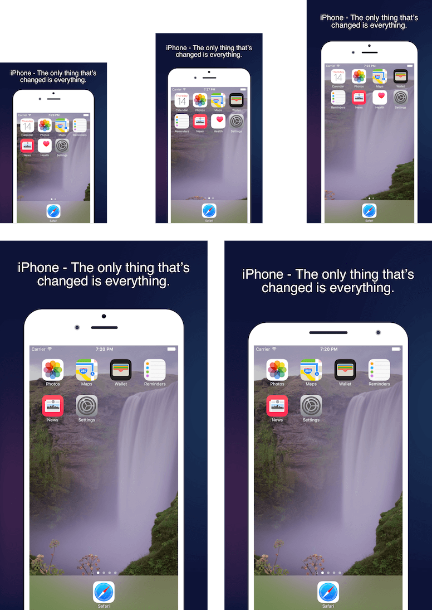

# App Screenshot Generator

Auto generate app screenshot for App Store & Google Play.

Support sizes supported:

- `3.5'`: iPhone 4/4S
- `4'`: iPhone 5/5S
- `4.7'`: iPhone 6/6S
- `5.5'`: iPhone 6+/6S+/Android

# Preview

# How to use

1. Capture the screenshots of your app & setup `config.json`
2. Install dependencies by `npm install`
3. Run the web service by `node app.js`
4. Generate beautiful screenshots by `sh build.sh YOUR_APP_NAME`

Checkout the sample folder `/public/images/Sample`.

# TODO

- Support multi themes
